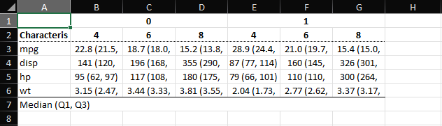
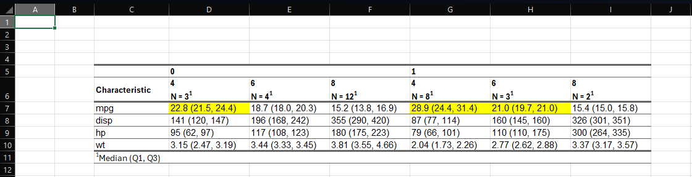

```{r}
#| label: setup
#| message: false
#| warning: false

library(dplyr)
library(gtsummary)
library(flextable)
library(openxlsx2)
library(flexlsx)
```

# Create your table  

Let's create a dummy table using the `mtcars` data set summarizing various 
measurements by transmission and number of cylinders (@tbl-mtcars).  

```{r}
#| label: tbl-mtcars

tbl <- mtcars |> 
  gtsummary::tbl_strata(
    strata = am,
    .tbl_fun = ~ .x |> 
      gtsummary::tbl_summary(
        by = cyl,
        include = c(
          mpg, disp, hp, wt
        )
      )
  )

tbl
```

# Export `gtsummary` table using `gtsummary::as_hux_table()`  

We can export the `gtsummary` object to XLSX using `gtsummary::as_hux_table()`.

```{r}
#| label: hux-export
#| eval: false

gtsummary::as_hux_xlsx(
  x = tbl,
  file = "../example-export/hux_table.xlsx"
)
```



The resulting export is okay, but manual changes are often required.  

# Export `flextable` using `flexlsx`  

Alternatively, we can convert our table to `flextable` and export the styled 
table using `flexlsx`.

```{r}
#| label: tbl-flextable

tbl_flex <- tbl |> 
  # convert gtsummary to flextable
  gtsummary::as_flex_table() |> 
  # automatically adjust width and height
  flextable::autofit() |> 
  # style table
  flextable::theme_vanilla() |> 
  # manually highlight cells where mpg > 20
  flextable::highlight(
    part = "body",
    j = c("stat_1_1", "stat_1_2", "stat_2_2"),
    i = 1
  )
  
tbl_flex
```

To export the `flextable` we need to create an Excel workbook and add a sheet. 
Once we have our sheet(s) created, we add the `flextable` to the specified 
sheet. Finally, after all tables are saved, we save the workbook.  

```{r}
#| label: export-flex
#| eval: false

# create workbook
wb <- openxlsx2::wb_workbook()
# add sheet(s)
wb <- openxlsx2::wb_add_worksheet(wb = wb, sheet = "Styled Table")
# insert tables into specified sheet
wb <- flexlsx::wb_add_flextable(wb = wb, sheet = "Styled Table", ft = tbl_flex,
                                dims = "C5")
# save workbook
openxlsx2::wb_save(
  wb = wb,
  file = "../example-export/flexlsx-table.xlsx"
)
```

The export table retains the styling and autofit expands the cell 
widths/heights so that it is easily readable in the XLSX file.  


