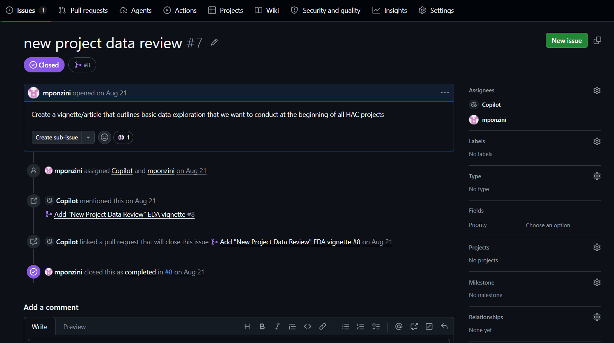
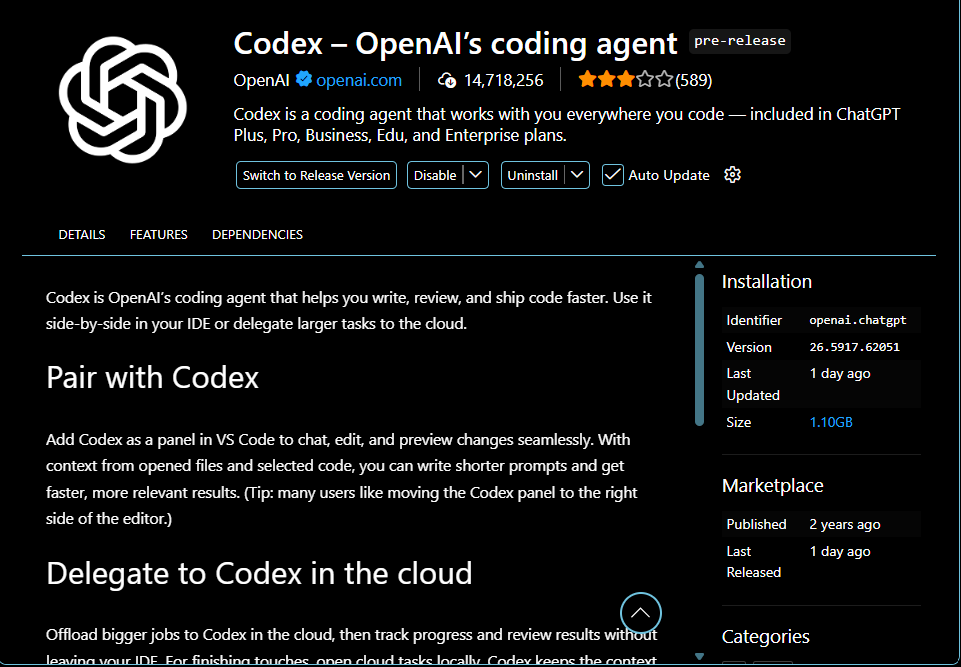

## Common LLM providers in R

- OpenAI
- Anthropic
- Google Gemini
- Meta (Llama)

## Introducing GitHub Copilot

An AI pair programmer that can help you:

- Complete and explain R code
- Generate functions, tests, and documentation
- Explore data analysis approaches
- Chat about code in your IDE

## Ways to use GitHub Copilot

- **Online chat**: Ask questions and explore ideas at GitHub.com
- **Assign an issue**: Delegate a defined task and review Copilot's pull request
- **Within RStudio**: Use inline autocomplete while writing R code
- **Code review**: Get feedback on a pull request before merging
- **Repository questions**: Understand code and documentation in context
- **Command line**: Get help with Git and shell commands using Copilot CLI

## Using GitHub Copilot on GitHub.com

1. Open [github.com/copilot](https://github.com/copilot)
2. Ask a question in Copilot Chat
3. Add repository or file context when helpful
4. Review, refine, and verify the response

---

Example prompts:

- "Explain this R function"
- "Suggest tests for this code"
- "How could I make this data pipeline clearer?"

---

<video controls autoplay muted loop playsinline width="100%" style="display: block; margin: 0 auto;">
  <source src="../inst/www/copilot-repository-overview.mp4" type="video/mp4">
</video>

## Assigning an issue to GitHub Copilot

1. Open or create an issue in a repository
2. Describe the task, context, and acceptance criteria
3. Assign the issue to **Copilot**
4. Copilot works on the task and opens a pull request
5. Review the changes, request updates, and merge when ready

---

Example issue:



---

<video controls autoplay muted loop playsinline width="100%" style="display: block; margin: 0 auto;">
  <source src="../inst/www/copilot-issue-example.mp4" type="video/mp4">
</video>

## Copilot autocomplete in RStudio

1. Enable Copilot in **Tools > Global Options > Copilot** and sign in
2. Start typing code or describe the next step in a comment
3. Review the gray inline suggestion
4. Press **Tab** to accept or **Esc** to dismiss it
5. Run tests and inspect the code before keeping it

---

Example prompt in an R script:

<video controls autoplay muted loop playsinline width="100%" style="display: block; margin: 0 auto;">
  <source src="../inst/www/copilot-autocomplete-example.mp4" type="video/mp4">
</video>

## Installing and configuring VS Code for R

1. Install [VS Code](https://code.visualstudio.com/) and [R](https://cran.r-project.org/)
2. Install the **R** extension from the VS Code Extensions view
3. Install R language support
4. Open an R project folder and create an `.R` file
5. Sign in to GitHub Copilot and enable inline suggestions

## Using GitHub Copilot through VS Code Chat

1. Open the **Chat** view and choose the appropriate mode
2. Ask Copilot to explain, generate, or refactor R code
3. Add context with references such as `#file` or `@workspace`
4. Review proposed edits before applying them
5. Run the code and tests, then refine the prompt if needed

---

Example prompt:

<video controls autoplay muted loop playsinline width="100%" style="display: block; margin: 0 auto;">
  <source src="../inst/www/vscode-chat-example.mp4" type="video/mp4">
</video>

## Installing Codex and connecting UCDH EDU ChatGPT

1. Open the VS Code **Extensions** view
2. Search for the official **Codex** extension and select **Install**
3. Open Codex from the Activity Bar or Command Palette
4. Choose **Sign in** and use your UCDH EDU ChatGPT account
5. Confirm that the UCDH organization or workspace is selected
6. Start with a small, non-sensitive coding task and review the result

---




# Using your own LLM provider in R

## Using `{ellmer}` in R

`{ellmer}` provides a consistent R interface for working with chat-based
large language models from different providers.

- Use your own provider API key
- Keep conversations in R objects
- Send prompts from scripts, functions, and reports
- Combine model responses with existing R workflows

## Install `{ellmer}` and configure your API key

Install the package once:

```r
install.packages("ellmer")
```

Store your key in an environment variable, not in an R script:

```r
Sys.setenv(OPENAI_API_KEY = "your-api-key")
```

For persistent local configuration, add the key to `.Renviron` and restart R.
Never commit `.Renviron` or share your API key.

## Create an `{ellmer}` chat

```r
library(ellmer)

chat <- chat_openai(
	model = "gpt-4o-mini",
	system_prompt = "You are a helpful R programming assistant."
)
```

The provider-specific constructor can be changed when working with another
supported model provider.

## Send prompts and use the response

```r
response <- chat$chat(
	"Explain how to handle missing values in a dplyr pipeline."
)

response
```

Treat model output as a draft: check the code, test the result, and monitor
API usage and costs.
